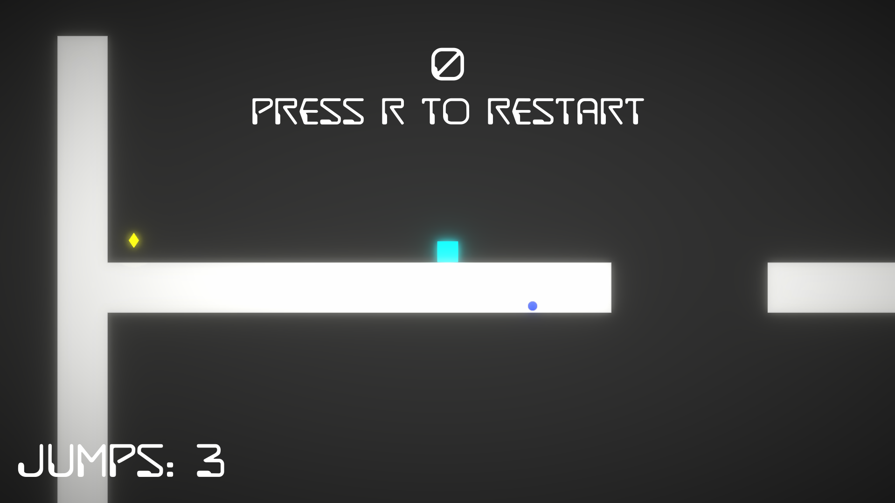
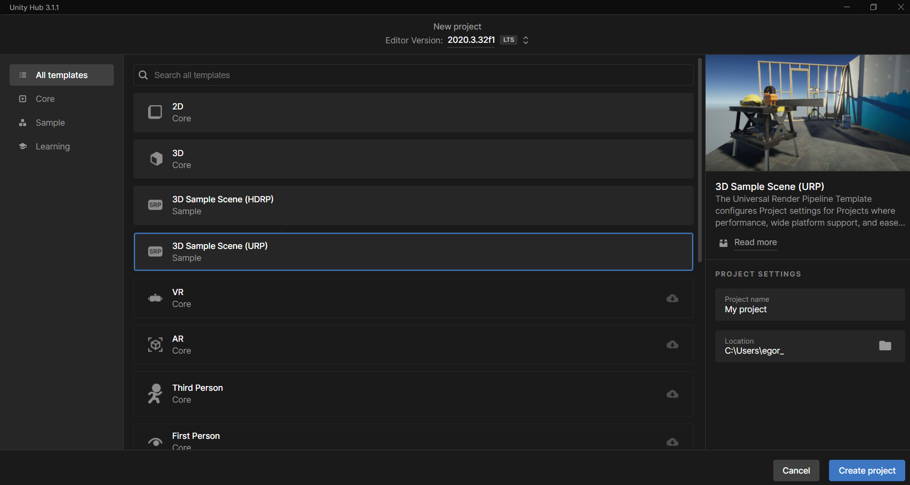
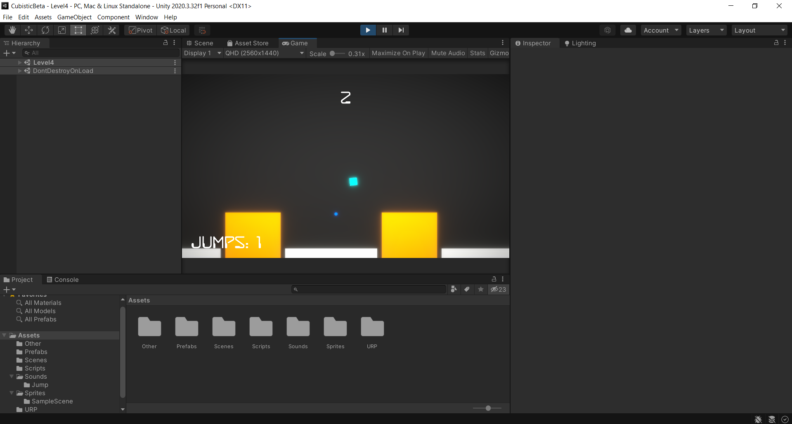

# CubisticOld

# Описание
Небольшая игра из 7 уровней, идея которой в том, что число прыжков в воздухе и на некоторых платформах ограничено

# Звпуск игры
Для запуска под windows скачайте Setup.ext файл

# Запуск с помощью Unity
Чтобы собрать игру для редактирования на Unity, нужно созодать новый проект: 3D сцена с URP постпроцессингомм.

Затем удалить папки: Assets, ProjectSettings, UserSettings, а вместо них вставить эти папки из CubisticCode

